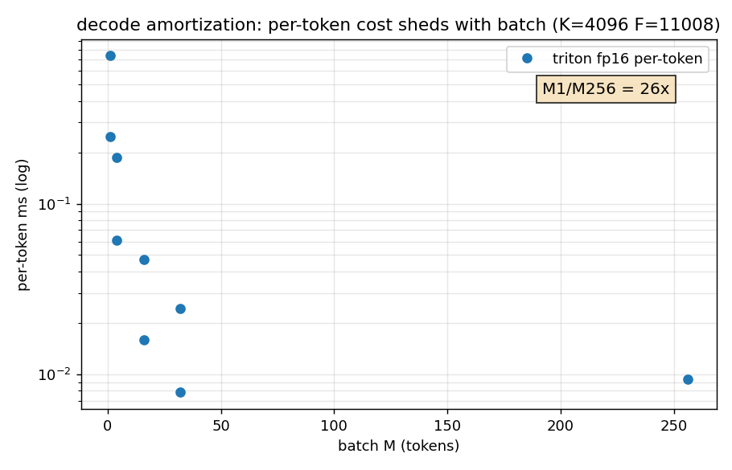
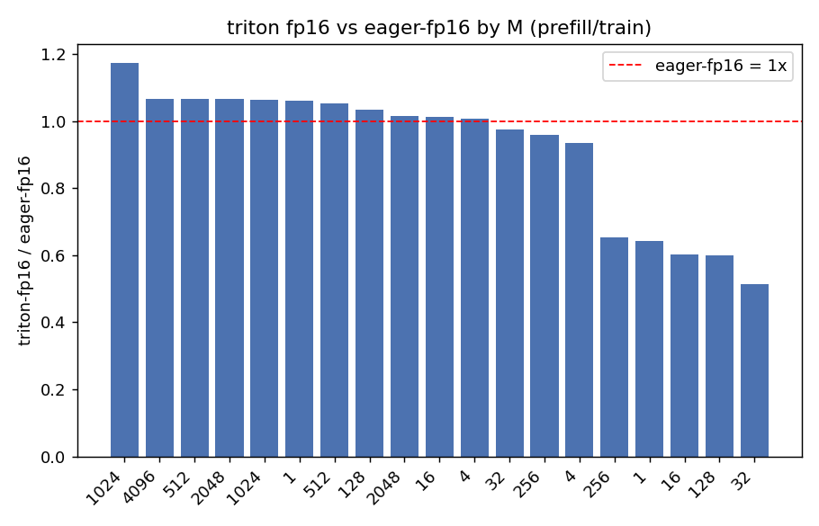
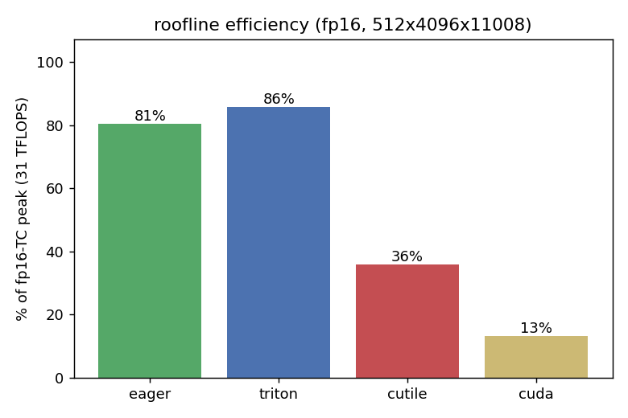

# MLP-Kernel-Lab (v2)

面向 **Transformer MLP** 的多后端 Kernel 正确性与性能实验系统：PyTorch eager / `torch.compile` / Triton / CUDA C++ / cuTile，
以 profile 驱动的优化方法论评估"在哪些 M/K/N、dtype、GPU 下自定义实现能超过 cuBLAS 基线"。

> 📌 **当前主线实验（v2）**：SwiGLU MLP block（`hidden = SiLU(X@W_gate) * (X@W_up)`，再 @W_down），
> decode / prefill / train 三档 shape sweep。[实验报告](docs/experiments/swiglu-sweep-20260831-3070.md) ·
> [证据矩阵](docs/claim-matrix.md) · [复现文档](REPRODUCE.md) · [EVIDENCE](EVIDENCE.md) · [已知限制](KNOWN-LIMITATIONS.md) · 一键复现: `make reproduce`

## 项目亮点

- **四/五后端对比**：PyTorch (cuBLAS) / torch.compile / Triton / CUDA / cuTile，同一 workload
- **SwiGLU MLP block 主线**：**跨精度**（FP16 Triton vs FP32 eager）吞吐比最高 **3.37x**、all-suite best 3.52x；但**同精度**（FP16 Triton vs FP16 eager）仅 **1.01-1.17x**（median 1.4%）。roofline 26.7 TFLOPS = 86% fp16-TC 峰值；decode 带宽 bound（利用率 13-20%，摊销 82.9x）
- **可追溯结果**：`make reproduce` 一键产出 manifest（commit/dirty/GPU/driver/依赖版本）+ correctness.jsonl + benchmark.json
- **正确性矩阵**：**226 项 pytest**（203 passed / 0 failed，SwiGLU block 多后端 × shape × dtype + 支持矩阵 + P1 opcheck/gradcheck（swiglu+matmul+layernorm）+ fp16/bf16 训练闭环）；strict FP32 reference 协议；cuda 算子级 fp16+bf16 已解锁（含块级 bf16 WMMA matmul）
- **CUDA kernel**：naive / tiled / fused / WMMA FP16（matmul_half, L2 2e-4）/ LayerNorm 多版本
- **精度控制**：TF32 / FP32 全局切换 + fp16/bf16 支持矩阵（`tests/test_transformer_mlp.py::DTYPE_SUPPORT`）

> ⚠️ 性能数字均有 GPU / dtype / shape / 协议标注，完整原始数据在 `artifacts/`；旧 MNIST 数字见"性能参考(legacy)"。

## 项目结构

```
MLP-Kernel-Lab/
├── kernels/                    # CUDA kernel 实现
│   ├── vector_add.cu           #   ~~LEGACY 练习模板~~（未被 setup.py 引用）
│   ├── matmul_naive.cu         #   ~~LEGACY 练习模板~~（同上）
│   ├── matmul_tiled.cu         #   ~~LEGACY 练习模板~~（同上）
│   ├── activation.cu           #   ~~LEGACY 练习模板~~（同上）
│   ├── mlp_fused_first_layer.cu#   ~~LEGACY 练习模板~~（同上）
│   ├── swiglu_fused.cu         #   ~~LEGACY 练习模板~~（同上）
│   ├── binding.cpp             #   PyTorch C++ extension 绑定
│   └── mlp/                    # PyTorch extension kernel (按算子族拆分)
│       ├── device_utils.cuh    #   公共 device 函数 (gelu/silu/warp_reduce)
│       ├── wmma_decl.cuh       #   WMMA kernel 前向声明
│       ├── matmul.cu           #   naive + tiled + transA + transB + bias_add
│       ├── wmma.cu             #   WMMA FP16 Tensor Core 6 个 kernel
│       ├── activation.cu       #   GELU/ReLU/SiLU forward + backward (+ vec4)
│       ├── fused.cu            #   mlp_fused_first_layer + swiglu_fused
│       ├── layernorm.cu        #   LayerNorm forward + backward (warp shuffle)
│       ├── softmax.cu          #   逐行 softmax (数值稳定)
│       └── pool_im2col.cu      #   MaxPool / AvgPool / im2col
├── triton_kernels/             # Triton kernel 实现
│   ├── matmul.py               #   分块矩阵乘法（L2 缓存优化）
│   ├── elementwise.py          #   BiasAdd、ReLU、GELU、SiLU、融合 BiasAdd+ReLU
│   ├── backward.py             #   MatMul backward、Activation backward
│   ├── layernorm.py            #   LayerNorm forward/backward
│   ├── dropout.py              #   Inverted dropout
│   ├── loss.py                 #   融合 CrossEntropy
│   ├── mlp_triton.py           #   融合 matmul+bias+GELU
│   ├── swiglu_triton.py        #   融合 SwiGLU
│   ├── precision.py            #   全局精度控制（TF32/FP32）
│   └── gpu_utils.py            #   GPU 检测模块
├── cutile_kernels/             # cuTile kernel 实现
│   ├── matmul.py               #   分块矩阵乘法（ct.mma）
│   ├── elementwise.py          #   BiasAdd、ReLU、GELU、SiLU、融合 BiasAdd+ReLU
│   ├── backward.py             #   MatMul backward、Activation backward
│   ├── layernorm.py            #   LayerNorm forward/backward
│   ├── mlp_cutile.py           #   融合 matmul+bias+GELU
│   └── swiglu_cutile.py        #   融合 SwiGLU
├── python/
│   ├── transformer_mlp.py      #   【v2 主线】SwiGLU MLP block 统一执行层（eager/concat/compile/triton/cuda/cutile/fused）
│   └── mnist/                  #   历史 MNIST 训练子项目（模型/layers/trainer/benchmark/dashboard）
├── bench/
│   ├── run.py                  #   【v2 主线】SwiGLU block 性能基准（CUDA Event, manifest）
│   └── suites/transformer_mlp.yaml  #   decode/prefill/train 三档 shape 配置
├── tests/
│   ├── test_triton_kernels.py  #   Triton kernel 正确性测试
│   ├── test_cuda_kernels.py    #   CUDA kernel 正确性测试
│   ├── test_cutile_kernels.py  #   cuTile kernel 正确性测试
│   ├── test_transformer_mlp.py #   【v2 主线】SwiGLU block 正确性 + dtype 支持矩阵
│   └── test_kernels.cu         #   6 项 C++ CUDA 单元测试
├── tools/
│   ├── reproduce.py            #   【v2 主线】make reproduce 驱动（build→test→bench→manifest）
│   └── render_swiglu.py        #   swiglu_bench.json → Markdown/CSV 渲染
├── configs/
│   └── mnist_mlp.yaml          # MNIST 训练配置
├── docs/
│   ├── claim-matrix.md         #   【v2 主线】主张→证据→级别 矩阵
│   └── experiments/            #   实验报告（swiglu-sweep-20260831-3070.md）
├── run_compare.py              # 历史：四后端对比训练
├── benchmark_ops.py            # 算子级横向对比（权威基准入口之一）
├── profiling/                  # Nsight Compute/Systems 脚本（ncu/nsys/profile_ops）
├── setup.py                    # CUDA extension 构建（动态架构探测）
├── Makefile                    # install / test / bench / reproduce / preflight
└── requirements.txt
```

## 快速开始

### 环境要求

- NVIDIA GPU（compute capability 7.5+）
- CUDA Toolkit 11.8+
- Python 3.8+
- PyTorch 2.0+
- Triton 2.0+
- cuTile 1.3+（可选，`pip install cuda-tile`）

> **WSL 用户注意**：仓库放在 `\\wsl.localhost\Ubuntu\...` 下时，Windows 端 git 会报 `dubious ownership`。在 Windows shell 执行一次：
>
> ```bash
> git config --global --add safe.directory '%(prefix)///wsl.localhost/Ubuntu/home/<user>/projects/MLP-Kernel-Lab'
> ```

### 安装

```bash
pip install -r requirements.txt
pip install cuda-tile            # 可选：启用 cuTile 后端
make install                     # 构建并安装 CUDA extension
```

### 检查环境

```bash
make check
```

### 四后端对比训练

```bash
python run_compare.py --cuda --cutile --precision fp32 --epochs 15   # 四后端 FP32 对比
python run_compare.py --cuda --cutile --precision tf32 --epochs 10   # 四后端 TF32 对比
python run_compare.py --cuda --epochs 5                              # PyTorch vs Triton vs CUDA
python run_compare.py --epochs 5                                     # PyTorch vs Triton
```

| 参数 | 说明 | 默认值 |
|------|------|--------|
| `--epochs` | 训练轮数 | 配置文件 |
| `--batch-size` | 批大小 | 256 |
| `--lr` | 学习率 | 0.001 |
| `--hidden` | 隐藏层维度 | 784,1024,512,256,10 |
| `--activation` | 激活函数 (relu/gelu/silu) | relu |
| `--dropout` | Dropout 率 | 0.1 |
| `--precision` | 精度模式 (tf32/fp32) | tf32 |
| `--cuda` | 启用 CUDA 后端 | - |
| `--cutile` | 启用 cuTile 后端 | - |
| `--no-bench` | 跳过基准测试 | - |

### 【v2 主线】SwiGLU MLP block 基准

```bash
python bench/run.py --suite all --dtypes fp32,fp16       # 全 shape sweep（带 manifest）
python bench/run.py --suite decode --dtypes fp16        # decode 档
make reproduce                                          # 一键：构建→测试→bench→manifest 归档
```

### 算子级基准测试（历史）

```bash
python benchmark_ops.py --precision fp32 --warmup 20 --iters 100
```

### 测试

```bash
make test-python       # Python 测试（136 项，含 SwiGLU block；通过数以 pytest 报告为准）
make test-cuda         # C++ CUDA 测试（6 项）
```

### Profiling

仓库提供 3 个互补 nsight 入口（详见 `profiling/README.md`）：

```bash
# 1. ncu (kernel 级 micro-arch 指标)
bash profiling/run_ncu.sh tiled              # CUDA tiled matmul auto-dispatch
bash profiling/run_ncu.sh cuda               # CUDA matmul + LayerNorm + activation
bash profiling/run_ncu.sh cutile             # cuTile matmul (需 cuda-tile)
bash profiling/run_ncu.sh mlp-cuda           # CUDAMLP 端到端 1 step
bash profiling/run_ncu.sh mlp-cutile         # CUTILEMLP 端到端 1 step
bash profiling/run_ncu.sh triton             # Triton MLP 1 step
bash profiling/run_ncu.sh compare            # PyTorch vs Triton torch.profiler

# 2. nsys (时间线 / NVTX 折叠 / 跨 step)
bash profiling/profile_nsys.sh tiled         # 单 kernel 重复 timeline
bash profiling/profile_nsys.sh mlp-cuda      # CUDAMLP 5 step timeline
bash profiling/profile_nsys.sh compare       # PyTorch vs Triton vs CUDA

# 3. 算子级 driver (NVTX 包裹, 任意维度, 跨 backend)
python profiling/profile_ops.py                          # 全 backend 全算子
python profiling/profile_ops.py --backend cuda triton    # 仅指定 backend
python profiling/profile_ops.py --ops matmul --M 2048 --K 2048 --N 2048
nsys profile -t cuda,nvtx -o results/nsys_ops python profiling/profile_ops.py
```

Makefile 短路:`make profile-tiled` / `make profile-nsys` / `make profile-ops` / `make profile-compare`。

## 实现状态

| 实现 | 说明 | 状态 |
|------|------|------|
| `transformer_mlp` | 【v2】SwiGLU block 统一执行层（eager/concat/compile/triton/cuda/cutile/fused） | 已完成 |
| `triton_fp16` | 【v2】Triton matmul fp16/bf16 TensorCore（input_precision + fp32 累加） | 已完成（norm_l2 2e-4/4e-3） |
| `fused_gateup` | 【v2】fused gate+up GEMM + SiLU epilogue（decode 实验，负结果保留） | 已完成（正确，性能负结果见报告） |
| `torch` | `torch.matmul` + `F.gelu` 基线 | 已完成 |
| `triton_mlp` | TritonLinear + TritonLayerNorm 端到端训练 | 已完成 |
| `triton_matmul` | `tl.dot` 分块矩阵乘法（L2 缓存优化 + autotune） | 已完成 |
| `triton_elementwise` | BiasAdd, ReLU, GELU, SiLU + backward | 已完成 |
| `triton_layernorm` | LayerNorm forward + backward | 已完成 |
| `triton_loss` | 融合 CrossEntropy | 已完成 |
| `triton_fused` | 融合 matmul + bias + GELU | 已完成 |
| `triton_swiglu` | 融合 SwiGLU | 已完成 |
| `cuda_tiled` | shared memory 分块矩阵乘法 | 已完成 |
| `cuda_fused` | 融合 matmul + bias + GELU | 已完成 |
| `cuda_layernorm` | LayerNorm forward + backward (warp shuffle) | 已完成 |
| `cuda_activation` | ReLU / GELU / SiLU forward + backward (vec4) | 已完成 |
| `cutile_matmul` | ct.mma 分块矩阵乘法 | 已完成 |
| `cutile_elementwise` | BiasAdd, ReLU, GELU, SiLU + backward | 已完成 |
| `cutile_layernorm` | LayerNorm forward + backward (ct.sum + atomic_add) | 已完成 |
| `cutile_fused` | 融合 matmul + bias + GELU | 已完成 |
| `cutile_swiglu` | 融合 SwiGLU | 已完成 |
| `cutile_fp16_block` | 【v2】SwiGLU block fp16/bf16（dtype 传播修复后，norm_l2 6e-4/4.7e-3） | 已完成 |
| torch.library op | 【v2】mlp_kernel::swiglu（schema/meta/autograd/opcheck/gradcheck/compile 全通过） | 已完成 |
| 训练闭环 | 【v2】pytorch/triton/cuda 训练收敛一致（loss 27.6→2.3） | 已完成 |

## v2 主线实测（RTX 3070 Laptop, 2026-08）

SwiGLU MLP block，CUDA Event 计时（strict FP32 对照固化于 bench/run.py），完整 228/152-case 数据在 `artifacts/`：

### 跨精度吞吐（FP16 Triton vs FP32 eager）—— 非"kernel 胜 cuBLAS"

| shape | FP32 eager | FP16 triton | 跨精度比 |
|---|---|---|---|
| 512 × 768 × 3072 | 0.996ms | **0.342ms** | **2.92x** |
| 2048 × 768 × 3072 | 4.223ms | **1.077ms** | **3.92x** |
| 512 × 4096 × 11008 | 16.17ms | **5.097ms** | **3.17x** |
| 2048 × 4096 × 11008 | 57.63ms | **19.23ms** | **3.00x** |
| all-suite 266-case best | — | — | **3.52x**（含 decode/prefill/train）|

> ⚠️ 该栏是**跨精度吞吐比**（FP16 相对 FP32），主要收益来自半精度算力的固有优势，不是自定义 kernel 比同精度 cuBLAS 快。

### fp16 同精度（Triton vs eager cuBLAS）—— 真实自定义 kernel 增益

| 后端（M=512×4096×11008, fp16, median） | 延迟 | 同精度比 vs eager | 正确性 norm_l2 |
|---|---|---|---|
| eager（cuBLAS） | 5.01ms | 1.00x | reference |
| **triton** | **4.60ms** | **1.09x** | 4.8e-4 |
| compile | 6.42ms | 0.78x | 4.9e-4 |
| triton_fused | 7.02ms | 0.71x | 2.9e-4 |
| cutile | 11.8ms（tile 优化后）| 0.42x | 5.7e-4 |
| cuda（matmul_half WMMA） | 29-118ms | 0.04-0.17x | 4.8e-4 |

> **结论（诚实）**：同精度下 Triton 相对 cuBLAS **仅微胜（+9%，全 case median 1.4%、峰值 1.17x）**；
> cuda/cutile 同精度显著落后。所谓"3.x 倍"是跨精度（FP16 vs FP32）吞吐比，主因是半精度算力，而非 kernel 实现更优。
> 完整数据 `artifacts/swiglu_20260901-013853-all-*`（266-case）。

### decode 摊销（K=4096/F=11008, fp16, per-token）

| batch M | 1 | 4 | 16 | 32 |
|---|---|---|---|---|
| per-token ms | **0.7798** | 0.186 | 0.047 | 0.024 |
| M=256 实测 ↓82.9x | | | | |

> 终版复核（2026-09-01, 归档 artifacts/swiglu_20260901-034658-decode-*，32-case corr 100%）：
> triton fp16 M=1 = 0.737ms；M=4/16/32 ≈ 0.74-0.78ms 总量（每 token 0.186/0.047/0.024ms）。
> **M=256 实测（2026-09-01）：每次 0.7798ms → 总 2.41ms，per-token 0.0094ms，M1/M256 摊销 82.9x**——
> decode 权重带宽 bound 本质不变（roofline 带宽利用率 23-36%）

> 结论：decode 小 M 是权重带宽 bound（融合 kernel 无效，负结果见报告）；大 decode batch 摊销后 per-token 成本↓80x。
> 完整分析：[docs/experiments/swiglu-sweep-20260831-3070.md](docs/experiments/swiglu-sweep-20260831-3070.md) · 证据矩阵：[docs/claim-matrix.md](docs/claim-matrix.md)

### 图（由 `tools/plot_perf_figures.py` 从归档数据生成）

| decode 摊销 | fp16 加速（按 shape） | roofline 效率 |
|---|---|---|
|  |  |  |

## 性能参考（legacy）

> 以下为历史 MNIST/5070 Ti 数据，仅作背景，不作为当前性能主张。

FP32 模式，模型 `[784,1024,512,256,10]`，ReLU + LayerNorm + Dropout=0.1，15 epochs：

> ⚠️ **此表为 legacy 参考（无 manifest）**：未记录 GPU/驱动/torch 版本，训练时长远高于下方 RTX 5070 Ti
> 实测表（89.9s vs 27.4s，量级差异说明设备/协议不同）。**不作为当前性能主张**，仅供历史对照；
> 当前性能请以"完整 4-backend 实测 (RTX 5070 Ti, ...)"小节及 `experiments/` 新实验目录为准。

| 指标 | PyTorch | Triton | CUDA | cuTile |
|------|---------|--------|------|--------|
| 准确率 | 98.71% | 98.61% | 98.64% | - |
| 训练时间 | 89.9s | 100.9s | 89.8s | - |
| 训练步延迟 | 3.30ms | 12.35ms | 8.85ms | - |
| 推理延迟 | 1.46ms | 2.13ms | **1.20ms** | - |
| 推理吞吐量 | 174.8K | 119.7K | **213.2K** | - |

> cuTile 列 `-` 表示尚未采集数据(需 cuTile 1.3+ 安装)。复现命令:
>
> ```bash
> pip install cuda-tile
> python run_compare.py --cuda --cutile --precision fp32 --epochs 15 \
>     | tee results/four_backend_fp32.txt
> ```
>
> 完成后将结果填入上表(参考 CHANGELOG 2026-05-27 #1 测得的正确性数据,只缺端到端延迟)。

### cuTile 单 step 微基准 (RTX 5070 Ti, FP32, B=256, 2026-06-02)

`python profiling/bench_cutile.py` 实测,每项 4 轮取后 3 轮均值(详见 `results/cutile_bench.json`):

| 算子 | mean ms | std |
|------|---------|-----|
| matmul (512×768·768×3072) | 1.091 | 0.001 |
| matmul_backward_a (dA = dC@B^T) | 1.375 | 0.001 |
| matmul_backward_b (dB = A^T@dC) | 2.033 | 0.003 |
| bias_add (512×3072) | 0.011 | 0.001 |
| gelu / silu / relu | 0.009–0.015 | — |
| gelu_backward | 0.010 | 0.000 |
| layernorm forward | 0.020 | 0.000 |
| layernorm backward | 0.259 | 0.001 |
| mlp_fused_first_layer (matmul+bias+GELU) | 1.069 | 0.001 |
| swiglu | 0.010 | 0.003 |

端到端 CUTILEMLP `[784,1024,512,256,10]` + LayerNorm + Dropout 0.1,batch=256:

| 指标 | cuTile (RTX 5070 Ti, 单 step) |
|------|----|
| 训练步延迟 | **2.256 ms** |
| 推理延迟 | **0.612 ms** |
| 推理吞吐量 | **418,556 samples/sec** |

> 注:此小节是 1 step 微基准,**未跑 15-epoch 完整训练**,不与上表同列直接比较 GPU 差异 — 原表在不同 GPU/不同 batch 上测得。要并列对照,请用 `run_compare.py --cuda --cutile --precision fp32 --epochs 15`(同机)采一份完整数据,再填回上表。

### 完整 4-backend 实测 (RTX 5070 Ti, FP32, 15 epoch, 2026-06-02)

同机同 config 跑 `python run_compare.py --cuda --cutile --precision fp32 --epochs 15`,模型 `[784,1024,512,256,10]` + LayerNorm + Dropout 0.1,batch=256。完整日志 `results/four_backend_fp32_v2.log`,benchmark JSON `results/compare_20260602_235625.json`。

| 指标 | PyTorch | Triton | CUDA | cuTile |
|------|---------|--------|------|--------|
| best val_acc | 98.71% | 98.62% | 98.65% | 98.52% |
| best at epoch | 12 | 15 | 15 | 14 |
| 训练时间(总) | 27.4s | 45.0s | **27.0s** | 30.4s |
| 训练步延迟 (median) | **1.500 ms** | 2.083 ms | 1.719 ms | 2.616 ms |
| 训练步延迟 (p95) | 3.522 ms | 5.517 ms | 4.594 ms | 6.047 ms |
| 训练吞吐量 (samples/s) | **170,698** | 122,889 | 148,936 | 97,845 |
| 推理延迟 (median) | 0.340 ms | 0.649 ms | **0.298 ms** | 0.711 ms |
| 推理吞吐量 (samples/s) | 753,331 | 394,487 | **858,139** | 360,044 |

**观察:**
- 4 后端精度差 ≤ 0.19pp,全部在 FP16 WMMA + TF32 + tanh-GELU 近似的合理噪声范围内。
- **CUDA backend**: 训练总时长最短(27.0s),推理延迟最低(0.298 ms / 858K samples/s)。WMMA64 FP16 Tensor Core 路径修复后启用,L0 / L1 大 matmul 在 64×64 tile 上提速。
- **PyTorch baseline (cuBLAS)**: 训练 step 最快(1.500ms),依赖高度优化的 cuBLAS GEMM。
- **Triton / cuTile**: 训练步比 PyTorch 慢 39–74%,主要来自 autotune cache miss + autograd graph 开销;推理路径同样差距(0.65–0.71ms vs 0.30–0.34ms)。
- **cuTile bench_cutile.py 单 step 0.61ms** 与此处端到端 0.71ms 一致(差距来自 dataloader + autograd 包装)。

### 跨模型 4-backend 对比 (RTX 5070 Ti, FP32 strict, 15 epoch, 4 轮末轮)

测试 3 个不同 MLP 拓扑对 4 backend 表现的影响,数据落 `results/full_eval_20260604_011723/model_*/`。运行:

```bash
MODELS=default,deep_narrow,wide_skip bash tools/run_full_eval.sh
```

| 模型 | 架构 | 参数量 | 测试目的 |
|------|------|--------|----------|
| `default` | 784→1024→512→256→10 + LN | 1.46M | 现行 baseline |
| `deep_narrow` | 784→256×8→10 + 每层 LN | 0.60M | 深度 + LN 多次摊销 |
| `wide_skip` | 784→1024×3→10 + 残差(后 2 层) + LN | 2.92M | 残差 + 大 hidden |

**default (4-layer, 1.46M):**

| backend | val_acc | 训练时间 | step_med | 吞吐 |
|---------|---------|----------|----------|------|
| PyTorch | **0.9871** | **25.1s** | 1.16ms | 221,395 |
| Triton  | 0.9865 | 45.3s | 2.27ms | 112,780 |
| CUDA    | 0.9867 | 26.8s | **1.08ms** | **237,248** |
| cuTile  | 0.9864 | 27.3s | 2.39ms | 107,014 |

**deep_narrow (8×256 + LN, 0.60M):**

| backend | val_acc | 训练时间 | step_med | 吞吐 |
|---------|---------|----------|----------|------|
| PyTorch | 0.9849 | 25.4s | 1.94ms | 132,232 |
| Triton  | 0.9853 | 40.9s | 2.62ms | 97,633 |
| CUDA    | **0.9858** | **26.1s** | **1.86ms** | **137,670** |
| cuTile  | 0.9847 | 27.6s | 2.10ms | 122,174 |

**wide_skip (3×1024 + 残差 + LN, 2.92M):**

| backend | val_acc | 训练时间 | step_med | 吞吐 |
|---------|---------|----------|----------|------|
| PyTorch | **0.9871** | **24.8s** | 1.30ms | 197,095 |
| Triton  | 0.9851 | 38.6s | 1.69ms | 151,216 |
| CUDA    | 0.9861 | 25.2s | 1.30ms | 196,437 |
| cuTile  | 0.9863 | 26.4s | 4.03ms | 63,477 |

**关键观察:**

1. **Triton 永远最慢 (38.6-45.3s)**,3 个模型一致。Python autograd + autotune 是固有问题,不是 kernel 不好。
2. **cuTile 在 deep_narrow 上追平 CUDA** (27.6 vs 26.1s,差距 <6%):(16,16,16) mma fragment 摊销好。
3. **cuTile 在 wide_skip 上 step_med 退化到 4.03ms**(default 2.39 的 1.7x):大 hidden 残差路径触发 `torch.add` 同步点。
4. **PyTorch (cuBLAS) 跨模型稳定** (24.8-25.4s):hidden dim 切换不敏感。
5. **val_acc 跨模型**:default ≈ wide_skip (0.987) > deep_narrow (0.985)。8 层窄 + 多次 LN 在 MNIST 上轻微欠拟合。

**场景化 backend 选择:**

| 场景 | 推荐 | 理由 |
|------|------|------|
| 浅 + 任意 hidden | PyTorch / CUDA | cuBLAS 已充分优化 |
| 深 + 多次小 matmul + LN | cuTile | 16×16×16 fragment 摊销 |
| 残差 + 大 hidden | PyTorch / CUDA | 残差 add 同步 + cuTile 大 tile 退化 |
| 生产路径(无教学需求) | PyTorch | 最快 + 最高 val_acc |
| 教学 / 算子对比 | 全部 4 backend | 暴露 kernel 设计取舍 |

## 许可证

MIT
